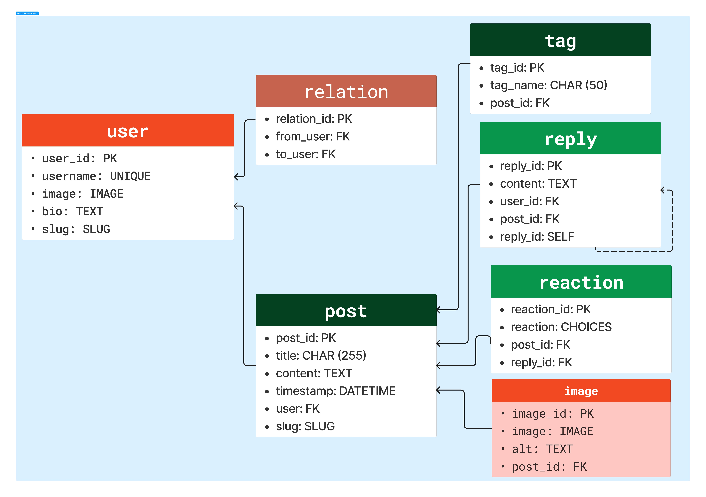

# Social network

Social network based on Django framework - **Daneshkar** *Python/Django* bootcamp.

**How does it works?**
In this social network:
- Each user has a profile with username, password, image and a short bio.
- Each user can view other users profile and follow them.
- Each user can post contents containing title, text content, some images and tags.
- Each user can reply to posts and other replies in a nested manner. User can like or dislike posts and replies.
- Each user can follow a specific tag as well.
- Each user can archive his/her own posts or profile. Other users can not access to archived posts or users.
- Before signing in, each user can only view posts and search usernames.

**How to use?**
1. First create a virtual environment:
`python3 -m venv venv`
2. Then, move to created venv:
`cd venv/`
3. Use the venv python intrepeter:
`source ./bin/activate`
4. Install prerequities:
`pip install -r requirements.txt`
5. Now you can use social network on your localhost:
`python3 manage.py runserver`

## Models designed based on below ERD
